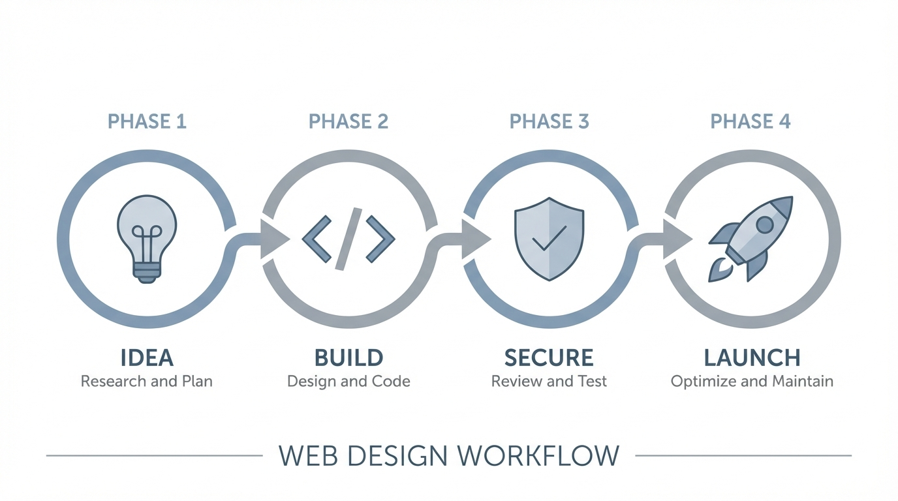
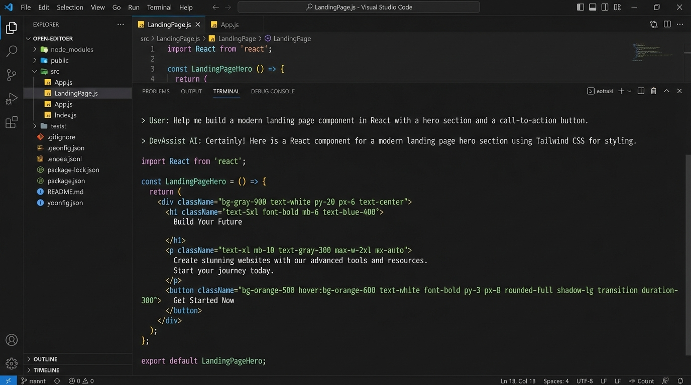

# The Web Design Workflow

[](LICENSE)


A complete web design system for Claude — 11 skills organized into 4 phases that cover the full lifecycle of a website, from idea to post-launch management. Works entirely within Claude Code — no Figma or external design tools required.





**This is for you if:**
- You use Claude Code or Claude.ai and want it to produce professional web design output
- You're building websites and want expert guidance at every stage without switching tools
- You're a beginner who wants a complete methodology — not just scattered prompts

> **You don't need to read or understand the skill files.** They're instructions for Claude, not for you. Just tell Claude what you want to build, and the right skill activates automatically.

---

## Contents

- [Quick Start](#quick-start-build-your-first-page)
- [Prerequisites](#prerequisites)
- [How to Install](#how-to-install)
- [The 4 Phases](#the-4-phases)
- [End-to-End Workflow](#end-to-end-complete-website-project)
- [Quick Reference](#quick-reference)
- [Examples](#examples)
- [Contributing](#contributing)

---

## Quick Start: Build Your First Page

**Option 1 — Claude Code (CLI):**
```bash
git clone https://github.com/deserteaglemjAEC/web-design-workflow.git
cp -r web-design-workflow/skills/* ~/.claude/skills/
```
Then run:
```
claude "Use the design-master skill to build me a landing page
for a coffee shop called Brewed Awakening. Modern, warm aesthetic.
Include a hero section, menu highlights, and a contact form."
```

**Option 2 — Claude.ai (zero setup):**
1. Open [claude.ai](https://claude.ai) and create a new **Project**
2. Click **Add project knowledge** and upload `skills/design-master.md`
3. Type: *"Build me a landing page for a coffee shop called Brewed Awakening"*

That's it. Claude reads the skill, follows the methodology, and generates production-ready code.

---

## What's in the Box

```
web-design-workflow/
├── skills/                           # 11 skill files (instructions for Claude)
│   ├── design-master.md              # Core design engine (frontend + email)
│   ├── translating-design-to-code.md # Any design input --> production code
│   ├── building-design-systems.md    # Color, type, spacing, tokens
│   ├── designing-ui-patterns.md      # Wireframes, flows, navigation
│   ├── researching-design-trends.md  # Industry trend analysis
│   ├── critiquing-designs.md         # Structured design critique
│   ├── auditing-accessibility.md     # WCAG 2.2 AA audits
│   ├── seo-web-design.md             # Meta tags, schema, technical SEO
│   ├── security-review.md            # OWASP Top 10 security checklist
│   ├── nanobanana-image-generation.md # AI image generation (Gemini)
│   └── image-prompt-formulas.md      # Proven prompt templates for images
├── examples/
│   ├── law-firm.md                   # Step-by-step law firm build
│   ├── restaurant.md                 # Step-by-step restaurant build
│   └── saas-startup.md              # Step-by-step SaaS landing page
└── docs/
    ├── workflow-diagram.png          # Visual workflow overview
    └── demo-screenshot.png           # Demo of Claude + skills
```

---

## Prerequisites

| Tool | Required? | How to Get It |
|------|-----------|---------------|
| **Claude Code** | Yes | [Install Claude Code](https://docs.anthropic.com/en/docs/claude-code) — Anthropic's CLI for Claude |
| **Node.js** (v18+) | Yes | [nodejs.org](https://nodejs.org) — needed to run the websites you build |
| **Git** | Yes | Comes with macOS. Windows: [git-scm.com](https://git-scm.com) |
| **Python 3** | Only for image generation | Comes with macOS. Windows: [python.org](https://python.org) |
| **Google Gemini API key** | Only for image generation | Free at [aistudio.google.com/apikey](https://aistudio.google.com/apikey) |

---

## How to Install

### Option A: Claude Code (CLI)

```bash
git clone https://github.com/deserteaglemjAEC/web-design-workflow.git
cp -r web-design-workflow/skills/* ~/.claude/skills/
```

Each skill auto-activates when you describe a matching task. You can also invoke directly:
```
"Use the design-master skill to build this landing page"
"Run an accessibility audit on this site"
```

### Option B: Claude.ai (Web)

1. Go to claude.ai and create a new **Project**
2. Click "Add project knowledge"
3. Upload the `.md` files from `skills/` as project knowledge
4. Claude will reference them in every conversation within that project

**Recommended project setup:**
- Project 1: "Web Design" — Phase 1 + Phase 2 skills
- Project 2: "Security & Launch" — Phase 3 + Phase 4 skills
- Project 3: "Image Generation" — nanobanana + image-prompt-formulas

### Option C: Cursor / Windsurf / Other AI IDEs

Copy `.md` files into your project's rules directory:
- **Cursor**: `.cursor/rules/`
- **Windsurf**: `.windsurfrules/`

---

## The 4 Phases

### Phase 1: Idea Generation

*Research, plan, and establish design foundations before touching any code.*

| Skill | File | What It Does |
|-------|------|-------------|
| **Researching Design Trends** | `researching-design-trends.md` | Analyze current trends in your client's industry. Produces adopt/monitor/ignore recommendations. |
| **Building Design Systems** | `building-design-systems.md` | Establish color palettes, typography scales, spacing systems, and design tokens. |
| **Designing UI Patterns** | `designing-ui-patterns.md` | Design user flows, wireframes, screen layouts, and navigation patterns. |

**Workflow:**
```
1. Research trends in the client's industry        --> researching-design-trends
2. Establish brand foundations (color, type, space) --> building-design-systems
3. Design the 3 most critical screens in depth     --> designing-ui-patterns
4. Self-review before presenting to client         --> critiquing-designs
```

**Try it:**
```
"Research current web design trends for law firms.
What should we adopt, monitor, or ignore?"
```

---

### Phase 2: Creation & Code

*Turn designs into production-ready code with professional imagery.*

| Skill | File | What It Does |
|-------|------|-------------|
| **Design Master** | `design-master.md` | The core design skill. Premium visual interface design for React/Next.js/Tailwind + HTML email. |
| **Translating Design to Code** | `translating-design-to-code.md` | Convert any design input (description, screenshot, wireframe) to production code. |
| **Nanobanana Image Generation** | `nanobanana-image-generation.md` | Generate and edit images using Google Gemini API. Up to 4K resolution. |
| **Image Prompt Formulas** | `image-prompt-formulas.md` | Proven prompt templates for hero images, product shots, team photos, textures. |

**Workflow:**
```
1. Set design dials (variance, motion, density)    --> design-master
2. Build components and pages from any design input --> translating-design-to-code
3. Generate hero images and visual assets          --> nanobanana + image-prompt-formulas
4. Run the pre-flight checklist                    --> design-master (section 1G or 2J)
```

**Try it:**
```
"Build me a responsive landing page for a fitness studio.
Dark theme, bold typography, hero section with a CTA,
class schedule grid, and testimonials section."
```

---

### Phase 3: Code Security

*Review code for vulnerabilities before deployment.*

| Skill | File | What It Does |
|-------|------|-------------|
| **Security Review** | `security-review.md` | OWASP Top 10 — secrets, input validation, SQL injection, XSS, CSRF, auth, rate limiting. |

**Workflow:**
```
1. Run the pre-deployment security checklist       --> security-review
2. Check: secrets, input validation, auth, headers
3. Run npm audit for dependency vulnerabilities
4. Verify HTTPS, CORS, CSP headers configured
5. Fix all critical/high issues before deploying
```

**Try it:**
```
"Run a security review on my project before I deploy.
Check for any vulnerabilities."
```

---

### Phase 4: Post-Launch Management

*Optimize, audit, and maintain the site after it's live.*

| Skill | File | What It Does |
|-------|------|-------------|
| **SEO for Web Designers** | `seo-web-design.md` | Meta tags, schema markup (JSON-LD), technical SEO, keyword targeting, AI/GEO visibility. |
| **Auditing Accessibility** | `auditing-accessibility.md` | WCAG 2.2 AA compliance audits using the POUR framework. |
| **Critiquing Designs** | `critiquing-designs.md` | Structured design critique using Nielsen's 10 heuristics. |

**Workflow:**
```
1. Run accessibility audit (WCAG AA)               --> auditing-accessibility
2. Run SEO audit (meta tags, schema, performance)  --> seo-web-design
3. Fix critical accessibility and SEO issues
4. Set up ongoing monitoring:
   - Google Search Console for search performance
   - PageSpeed Insights for Core Web Vitals
   - Quarterly accessibility re-audits
5. Design critique for UX improvements              --> critiquing-designs
```

**Try it:**
```
"Run an accessibility audit and SEO audit on my site.
Give me a prioritized list of fixes."
```

---

## End-to-End: Complete Website Project

```
PHASE 1: IDEA GENERATION
  [1] Research industry design trends
  [2] Build design system (color, type, spacing)
  [3] Design critical screens (home, primary task, contact)
  [4] Self-critique before client review

PHASE 2: CREATION & CODE
  [5] Set design dials + build pages in code
  [6] Generate hero images and visual assets
  [7] Run design pre-flight check

PHASE 3: SECURITY
  [8] Run security checklist (OWASP Top 10)
  [9] Fix all critical vulnerabilities
  [10] Verify HTTPS, headers, auth

PHASE 4: POST-LAUNCH
  [11] Run accessibility audit (WCAG AA)
  [12] Run SEO audit + add schema markup
  [13] Submit sitemap to Google Search Console
  [14] Set up quarterly re-audit schedule
```

---

## Setup: Image Generation (Optional)

Only needed if you want to generate images with AI:

1. Get a free Google Gemini API key at https://aistudio.google.com/apikey
2. Save it:
   ```bash
   echo 'GEMINI_API_KEY=your-key-here' > ~/.nanobanana.env
   ```
3. Install Python dependencies:
   ```bash
   pip install google-genai Pillow python-dotenv
   ```

Everything else works out of the box — no setup required.

---

## Quick Reference

| I want to... | Phase | Skill |
|--------------|-------|-------|
| Research what's trending in web design | 1 | researching-design-trends |
| Create a color palette / type scale | 1 | building-design-systems |
| Design screens and user flows | 1 | designing-ui-patterns |
| Build a website with premium aesthetics | 2 | design-master |
| Convert any design to React/Vue/HTML | 2 | translating-design-to-code |
| Generate a hero image or product shot | 2 | nanobanana + image-prompt-formulas |
| Check code for security vulnerabilities | 3 | security-review |
| Audit accessibility (WCAG AA) | 4 | auditing-accessibility |
| Optimize SEO, meta tags, schema markup | 4 | seo-web-design |
| Get structured design feedback | 4 | critiquing-designs |

---

## Examples

See the `examples/` folder for industry-specific step-by-step guides:

- **[Law Firm Website](examples/law-firm.md)** — Authority + approachability, ADA compliance priority, local SEO, client intake forms
- **[Restaurant Website](examples/restaurant.md)** — Food photography, reservation UX, menu as HTML (not PDF), Restaurant schema
- **[SaaS Startup Landing Page](examples/saas-startup.md)** — Conversion-focused, bento grid features, pricing table, performance-critical

---

## Contributing

Pull requests welcome — especially additional `examples/` for new industries.
Open an [issue](https://github.com/deserteaglemjAEC/web-design-workflow/issues) to request a skill or report a problem.

---

## License

[MIT](LICENSE) — free to use, modify, and share.
